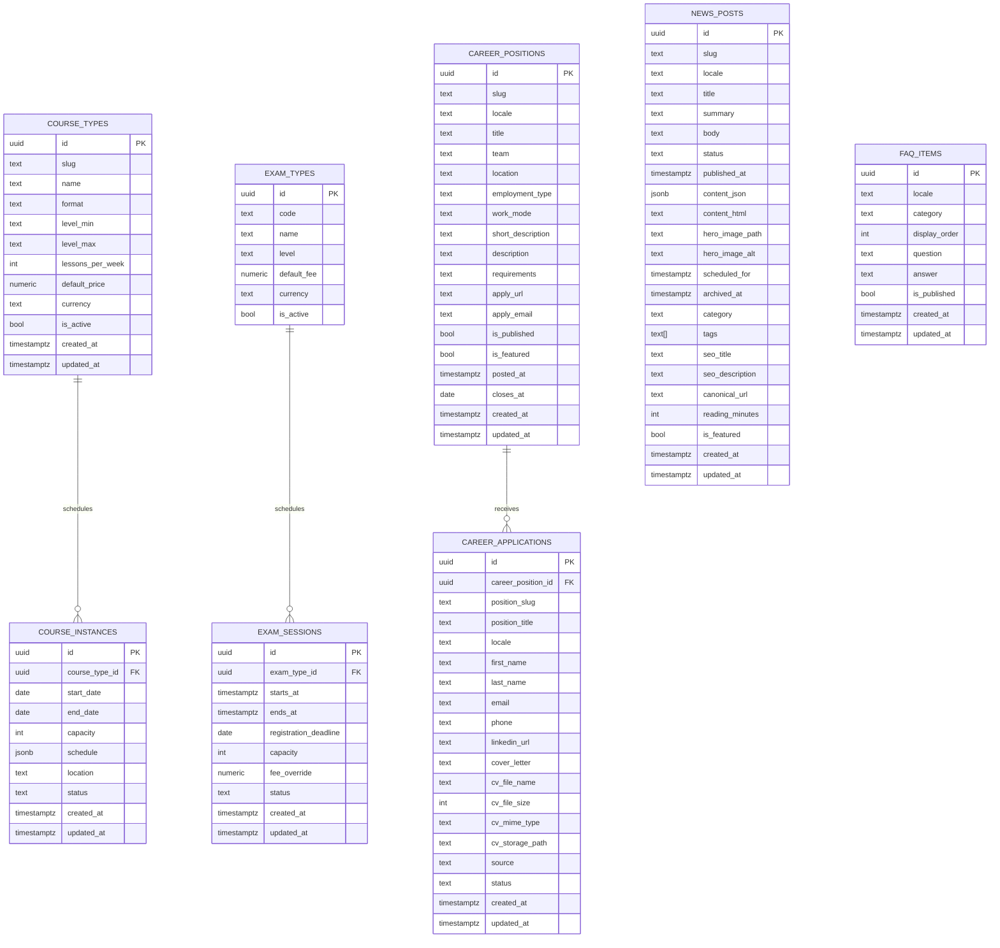

# CASA Public Data Model

## Scope
This ERD reflects the current public-site-only product scope. Historical portal and role-oriented schema work still exists in older migration files, but it is not part of the intended active model.

## Notes
- `course_instances.schedule` should remain structured JSON.
- Public reads should only expose active or publishable records.
- `career_applications` remains a public insert path with storage-backed CV upload support.
- `news_posts` keeps scheduling fields because the public site still auto-publishes due posts through a service-role RPC.
