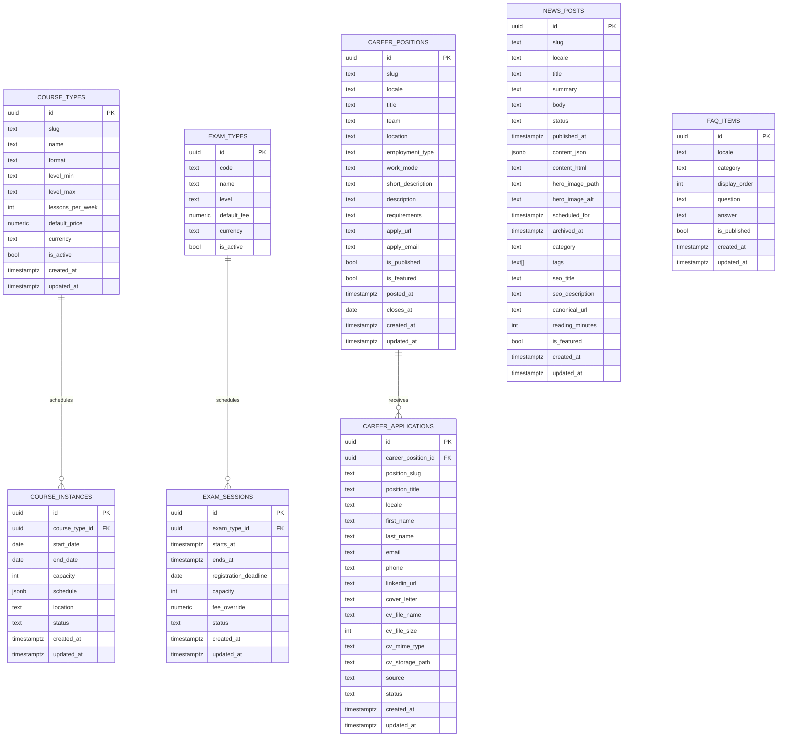
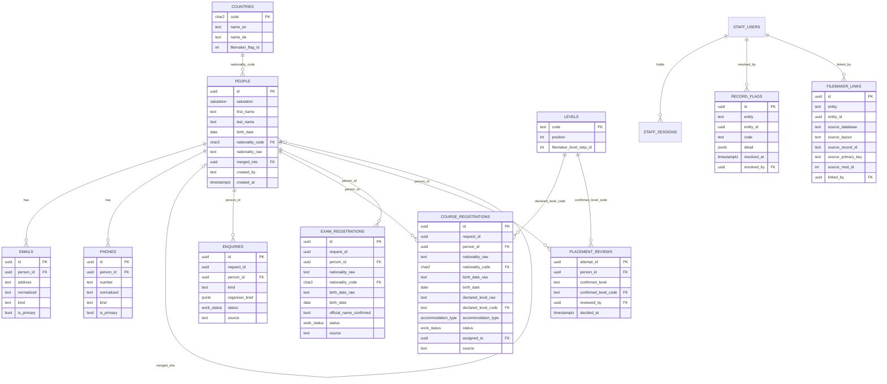
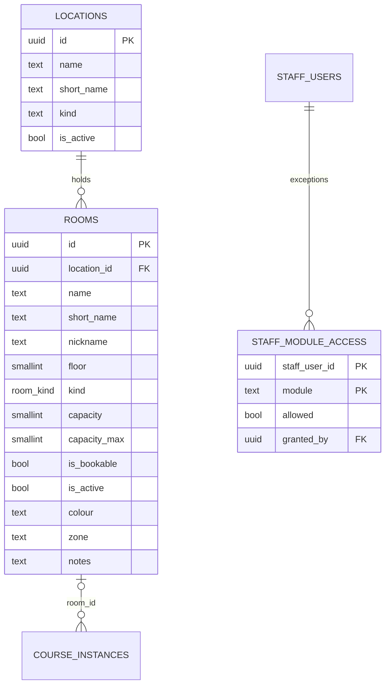

# CASA Data Model

## Scope
Two models share one database. The first is the public site's content and
intake tables (0001–0005). The second, below it, is the staff workspace's
queues and its person register (0006–0007). Historical portal and
role-oriented schema work still exists in older migration files, but it is
not part of the intended active model.

## Staff workspace, person register, rooms and access (0006–0008)

`record_flags` and `filemaker_links` are polymorphic by `(entity, entity_id)`
and carry no foreign key to the row, the same pattern as `staff_notes`.
`canonical_person_id(uuid)` is the read-time function that follows
`people.merged_into`; every reader that groups by person calls it rather than
reading `person_id` directly.

## Notes
- `course_instances.schedule` should remain structured JSON.
- Public reads should only expose active or publishable records.
- `career_applications` remains a public insert path with storage-backed CV upload support.
- `news_posts` keeps scheduling fields because the public site still auto-publishes due posts through a service-role RPC.
